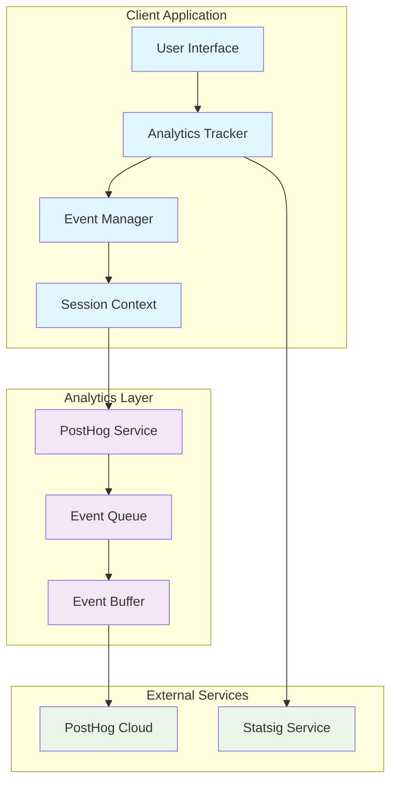

# Design Document: PostHog Analytics Measurement

## Overview

This design implements a comprehensive analytics measurement system using PostHog for the Lilium church management application. The system will provide deep insights into user behavior, feature usage, and business metrics while maintaining privacy and performance standards.

The design leverages the existing PostHog integration and extends it with structured event tracking, user journey analysis, and church-specific business metrics. It builds upon the current dual analytics approach (Statsig + PostHog) with a focus on making PostHog the primary analytics platform.

## Architecture

### High-Level Architecture



### Component Architecture

The analytics system consists of several key components:

1. **Analytics Tracker**: Central component that captures user interactions
2. **Event Manager**: Processes and enriches events before sending
3. **Session Context Manager**: Maintains user session state and metadata
4. **PostHog Service**: Enhanced service for structured event tracking
5. **Event Queue**: Handles offline scenarios and batch processing

## Components and Interfaces

### Enhanced PostHog Service

```typescript
interface AnalyticsEvent {
  name: string;
  properties: Record<string, any>;
  timestamp: Date;
  sessionId: string;
  userId?: string;
  userRole?: 'admin' | 'member' | 'guest';
  churchContext?: ChurchContext;
}

interface ChurchContext {
  churchId: string;
  region?: string;
  userPermissions: string[];
}

interface UserJourney {
  sessionId: string;
  startTime: Date;
  pages: PageVisit[];
  actions: UserAction[];
  conversionEvents: ConversionEvent[];
}
```

### Analytics Tracker Interface

```typescript
interface AnalyticsTracker {
  // Core tracking methods
  trackPageView(page: string, properties?: Record<string, any>): Promise<void>;
  trackUserAction(action: string, properties?: Record<string, any>): Promise<void>;
  trackConversion(funnel: string, step: string, properties?: Record<string, any>): Promise<void>;
  
  // Church-specific tracking
  trackChurchEvent(eventType: ChurchEventType, properties: ChurchEventProperties): Promise<void>;
  trackAdminAction(action: AdminAction, properties?: Record<string, any>): Promise<void>;
  trackCommunityEngagement(type: CommunityEngagementType, properties?: Record<string, any>): Promise<void>;
  
  // Performance tracking
  trackPerformance(metric: PerformanceMetric): Promise<void>;
  trackError(error: ErrorEvent): Promise<void>;
}
```

### Event Categories and Types

```typescript
enum ChurchEventType {
  SCHEDULE_VIEW = 'schedule_view',
  SCHEDULE_CREATE = 'schedule_create',
  SCHEDULE_EDIT = 'schedule_edit',
  MASS_VIEW = 'mass_view',
  MASS_CREATE = 'mass_create',
  MASS_EDIT = 'mass_edit',
  COMMUNITY_VIEW = 'community_view',
  COMMUNITY_INTERACT = 'community_interact'
}

enum AdminAction {
  USER_MANAGEMENT = 'user_management',
  SCHEDULE_MANAGEMENT = 'schedule_management',
  MASS_MANAGEMENT = 'mass_management',
  REPORT_GENERATION = 'report_generation',
  SYSTEM_CONFIGURATION = 'system_configuration'
}

enum CommunityEngagementType {
  LINGKUNGAN_VIEW = 'lingkungan_view',
  LINGKUNGAN_PARTICIPATE = 'lingkungan_participate',
  COMMUNITY_POST = 'community_post',
  COMMUNITY_COMMENT = 'community_comment'
}
```

## Data Models

### Event Schema

```typescript
interface BaseEvent {
  // Core event properties
  event_name: string;
  timestamp: string;
  session_id: string;
  page_url: string;
  user_agent: string;
  
  // User context
  user_id?: string;
  user_role?: 'admin' | 'member' | 'guest';
  user_permissions?: string[];
  
  // Church context
  church_id?: string;
  church_region?: string;
  
  // Technical context
  app_version: string;
  environment: 'development' | 'production';
}

interface PageViewEvent extends BaseEvent {
  event_name: 'page_view';
  page_title: string;
  referrer?: string;
  time_on_page?: number;
  scroll_depth?: number;
}

interface UserActionEvent extends BaseEvent {
  event_name: 'user_action';
  action_type: string;
  action_target: string;
  action_result: 'success' | 'failure' | 'cancelled';
  action_duration?: number;
}

interface ConversionEvent extends BaseEvent {
  event_name: 'conversion';
  funnel_name: string;
  funnel_step: string;
  step_order: number;
  conversion_value?: number;
}
```

### User Journey Model

```typescript
interface UserSession {
  session_id: string;
  user_id?: string;
  start_time: Date;
  end_time?: Date;
  duration?: number;
  page_count: number;
  action_count: number;
  conversion_count: number;
  entry_page: string;
  exit_page?: string;
  referrer?: string;
  device_type: 'desktop' | 'mobile' | 'tablet';
  user_role?: 'admin' | 'member' | 'guest';
}
```

## Correctness Properties

*A property is a characteristic or behavior that should hold true across all valid executions of a system—essentially, a formal statement about what the system should do. Properties serve as the bridge between human-readable specifications and machine-verifiable correctness guarantees.*

### Property Reflection

After analyzing all acceptance criteria, I identified several areas where properties can be consolidated to eliminate redundancy:

- Properties for tracking different feature types (jadwal, misa, lingkungan) can be combined into a comprehensive feature interaction property
- User identification and session context properties can be unified into a single session management property
- Performance tracking properties can be consolidated into a comprehensive performance monitoring property
- Privacy and data protection properties can be combined into a unified data handling property

### Core Analytics Properties

**Property 1: Analytics System Initialization**
*For any* environment configuration (development or production), initializing the Analytics System should result in a properly configured PostHog client with environment-appropriate settings
**Validates: Requirements 1.1**

**Property 2: User Session Management**
*For any* user session start, the Analytics System should identify the user with their complete context including role, permissions, and church information
**Validates: Requirements 1.2**

**Property 3: Universal Page Tracking**
*For any* page navigation in the application, the Analytics System should automatically capture a page view event with proper routing information
**Validates: Requirements 1.3**

**Property 4: Event Context Enrichment**
*For any* analytics event captured, the event should include complete session context and user metadata
**Validates: Requirements 1.4**

**Property 5: Offline Resilience**
*For any* offline scenario, the Analytics System should continue to function without blocking user interactions and queue events for later transmission
**Validates: Requirements 1.5**

### User Journey Properties

**Property 6: Entry Point Tracking**
*For any* homepage visit, the Event Tracker should capture entry point and referrer information
**Validates: Requirements 2.1**

**Property 7: Navigation Path Tracking**
*For any* page navigation, the Event Tracker should record the navigation path and time spent on the previous page
**Validates: Requirements 2.2**

**Property 8: Key Action Completion Tracking**
*For any* key user action (login, registration, event creation), the Event Tracker should record the completion with appropriate context
**Validates: Requirements 2.3**

**Property 9: Multi-Step Process Abandonment**
*For any* abandonment in a multi-step process, the Event Tracker should capture the drop-off point and context
**Validates: Requirements 2.4**

**Property 10: Session Termination Recording**
*For any* session end, the Event Tracker should record session duration and pages visited
**Validates: Requirements 2.5**

### Feature Usage Properties

**Property 11: Comprehensive Feature Interaction Tracking**
*For any* user interaction with application features (admin functions, scheduling, mass services, community features), the Event Tracker should record the interaction with appropriate feature-specific context and usage patterns
**Validates: Requirements 3.1, 3.2, 3.3, 3.4**

### Conversion Funnel Properties

**Property 12: Registration Funnel Tracking**
*For any* user progressing through the registration funnel, the Analytics System should track each step from landing to successful account creation
**Validates: Requirements 4.1**

**Property 13: Event Creation Funnel Tracking**
*For any* attempt to create events or schedules, the Analytics System should track completion rates and abandonment points
**Validates: Requirements 4.2**

**Property 14: Admin Onboarding Funnel**
*For any* admin user, the Analytics System should track the onboarding journey from first login to first administrative action
**Validates: Requirements 4.3**

**Property 15: Community Participation Tracking**
*For any* engagement with church community features, the Analytics System should track participation conversion rates
**Validates: Requirements 4.4**

### Performance and Error Properties

**Property 16: Comprehensive Performance Monitoring**
*For any* performance issue (slow page loads, slow interactions, API delays), the Analytics System should capture performance metrics with complete user context
**Validates: Requirements 5.1, 5.4**

**Property 17: Error Tracking with Context**
*For any* JavaScript error occurrence, the Analytics System should log error details with complete user session information
**Validates: Requirements 5.2**

**Property 18: API Performance Tracking**
*For any* API call for critical user actions, the Analytics System should track response times and failure rates
**Validates: Requirements 5.3**

### Church-Specific Properties

**Property 19: Mass Schedule Interest Tracking**
*For any* mass schedule view, the Event Tracker should track which services generate interest with appropriate metrics
**Validates: Requirements 6.1**

**Property 20: Administrative Efficiency Tracking**
*For any* Church Admin event creation or modification, the Event Tracker should measure administrative efficiency and usage patterns
**Validates: Requirements 6.2**

**Property 21: Community Engagement Measurement**
*For any* community feature interaction, the Event Tracker should measure engagement levels appropriately
**Validates: Requirements 6.4**

### Privacy and Compliance Properties

**Property 22: Data Collection Compliance**
*For any* data collection operation, the Analytics System should only collect data necessary for product improvement purposes
**Validates: Requirements 7.1**

**Property 23: Opt-Out Respect**
*For any* user who opts out of analytics, the Analytics System should immediately stop data collection for that user
**Validates: Requirements 7.2**

**Property 24: PII Anonymization**
*For any* analytics event containing personally identifiable information, the Analytics System should properly anonymize the PII before transmission
**Validates: Requirements 7.3**

**Property 25: Sensitive Data Protection**
*For any* handling of sensitive church data, the Analytics System should apply appropriate data protection measures
**Validates: Requirements 7.5**

### Reporting Properties

**Property 26: Role-Based Report Segmentation**
*For any* report generation, the Analytics System should include proper user segmentation by role (admin vs member)
**Validates: Requirements 8.2**

<function_calls>
<invoke name="prework">
<parameter name="featureName">posthog-analytics-measurement

## Error Handling

### Analytics Service Error Handling

The analytics system must be resilient and never interfere with the core application functionality:

1. **Graceful Degradation**: If PostHog is unavailable, the application continues to function normally
2. **Event Queue Management**: Failed events are queued and retried with exponential backoff
3. **Circuit Breaker Pattern**: Temporary failures trigger circuit breaker to prevent cascading issues
4. **Error Logging**: Analytics errors are logged separately without affecting user experience
5. **Fallback Mechanisms**: Critical events can fall back to Statsig if PostHog fails

### Privacy Error Handling

1. **PII Detection Failures**: If PII anonymization fails, the event is dropped rather than sent
2. **Opt-Out Enforcement**: If opt-out status cannot be determined, default to not collecting data
3. **Consent Validation**: Events are only sent after explicit consent validation

### Performance Error Handling

1. **Timeout Management**: Analytics calls timeout after 5 seconds to prevent blocking
2. **Memory Management**: Event buffers have size limits to prevent memory leaks
3. **Network Failure Recovery**: Offline events are persisted locally and sent when connectivity returns

## Testing Strategy

### Dual Testing Approach

The analytics system requires both unit tests and property-based tests for comprehensive coverage:

**Unit Tests** focus on:
- Specific event formatting and validation
- Error handling scenarios
- Integration points with existing services
- Privacy compliance edge cases
- Configuration validation

**Property-Based Tests** focus on:
- Universal properties that hold across all user interactions
- Event consistency across different user roles and contexts
- Performance characteristics under various load conditions
- Data integrity across the entire analytics pipeline

### Property-Based Testing Configuration

- **Testing Framework**: Use `fast-check` for TypeScript property-based testing
- **Test Iterations**: Minimum 100 iterations per property test
- **Event Generation**: Smart generators that create realistic user sessions and interactions
- **Church Context Generation**: Generators for various church roles, permissions, and contexts

### Test Tag Format

Each property test must reference its design document property:
**Feature: posthog-analytics-measurement, Property {number}: {property_text}**

### Integration Testing

1. **PostHog Integration**: Verify events reach PostHog with correct structure
2. **Statsig Compatibility**: Ensure dual analytics approach works seamlessly
3. **Session Management**: Test session lifecycle and context propagation
4. **Privacy Compliance**: Verify PII anonymization and opt-out functionality
5. **Performance Impact**: Measure analytics overhead on application performance

### Church-Specific Testing

1. **Role-Based Testing**: Test analytics behavior for different user roles (admin, member, guest)
2. **Feature-Specific Testing**: Verify tracking for jadwal, misa, and lingkungan features
3. **Seasonal Testing**: Test analytics during different church calendar periods
4. **Multi-Church Testing**: Verify analytics work correctly across different church contexts

The testing strategy ensures that analytics provide valuable insights while maintaining system reliability and user privacy.