# QueueManager Overview

The **QueueManager** is a Singleton class that manages the assignment of ushers to positions for church events. It follows a queue-based system where events are submitted for processing, and ushers are assigned positions using a role-based round-robin algorithm.

## Key Components:

1. **Singleton Pattern**: Ensures only one instance exists throughout the application
2. **Queue System**: Manages confirmation requests for event processing
3. **Role-Based Position Assignment**: Uses separate round-robin algorithms for different usher roles
4. **Feature Flag Support**: Handles PPG (Pemuda Pemudi Gereja) positions based on feature flags
5. **Position Tracking**: Maintains separate indices for PPG and non-PPG positions

## Core Architecture

### State Management:
- `confirmationQueue`: Queue of events waiting for position assignment
- `eventUshers`: Current ushers for the event being processed
- `massZonePositions`: Available positions for the mass
- `eventPositions`: Filtered positions based on feature flags
- `assignedUshers`: Ushers with newly assigned positions
- `isPpgEnabled`: Feature flag state for PPG functionality
- `nextIndexNonPpg` & `nextIndexPpg`: Round-robin indices for position assignment

### Related Functions:

#### Core QueueManager Methods:
- `getInstance()`: Returns singleton instance
- `submitConfirmationQueue()`: Adds event to processing queue
- `processQueue()`: Main processing logic for position assignment
- `distributePositionsByRole()`: Assigns positions using role-based round-robin algorithm
- `reset()`: Clears all internal state
- `findLatestUniquePositionId()`: Finds the most recently assigned position for continuity
- `nextPositionIndex()`: Calculates next position index for assignment

#### Database Repository Methods:
- `repo.getPositionsByMass()`: Retrieves available positions for a mass
- `repo.getEventUshers()`: Gets ushers assigned to an event
- `repo.editEventUshers()`: Updates usher positions in database

#### Supporting Services:
- `EventService`: Manages church events
- `statsigService.checkGate()`: Checks if PPG feature is enabled

## Role-Based Distribution System

### Position Categories:
- **PPG Positions**: Positions specifically for Pemuda Pemudi Gereja (youth ministry)
- **Non-PPG Positions**: Regular positions for all other ushers

### Usher Role Categories:
- **PPG Ushers** (`isPpg = true`): Youth ministry ushers
- **Kolekte Ushers** (`isKolekte = true` and `isPpg = false`): Collection ushers
- **Regular Ushers** (neither PPG nor Kolekte): Standard ushers

### Distribution Rules:

#### When `isPpgEnabled` is `true`:
1. **PPG Ushers** → Assign to next available PPG position
2. **Kolekte Ushers** → Assign to next available non-PPG position
3. **Regular Ushers** → Assign to next available non-PPG position

#### When `isPpgEnabled` is `false`:
1. **All Ushers** (regardless of role) → Assign only to non-PPG positions
2. **No PPG assignments** → PPG positions are completely ignored

### Round-Robin Algorithm:
- **Separate Tracking**: PPG and non-PPG positions maintain independent round-robin indices
- **Continuity**: Uses `findLatestUniquePositionId()` to determine the next position based on existing assignments
- **Fair Distribution**: Ensures even distribution within each role category

## Updated Sequence Diagram

```mermaid
sequenceDiagram
    participant Client
    participant QueueManager
    participant StatsigService
    participant EventService
    participant Repository
    participant Database

    Note over Client, Database: QueueManager Role-Based Position Distribution

    %% Initialization
    Client->>QueueManager: getInstance()
    QueueManager->>QueueManager: new QueueManager()
    QueueManager->>StatsigService: checkGate('ppg')
    StatsigService-->>QueueManager: isPpgEnabled = true/false
    QueueManager->>EventService: new EventService(churchId)
    QueueManager-->>Client: QueueManager instance

    %% Submit Queue
    Client->>QueueManager: submitConfirmationQueue(event, lingkungan)
    QueueManager->>QueueManager: confirmationQueue.push({event, lingkungan})
    QueueManager-->>Client: void

    %% Process Queue
    Client->>QueueManager: processQueue()
    QueueManager->>QueueManager: assignedUshers = []
    
    loop For each batch in confirmationQueue
        %% Get Positions
        QueueManager->>Repository: getPositionsByMass(event.church, event.mass)
        Repository->>Database: SELECT positions WHERE church=churchId AND mass=massId
        Database-->>Repository: ChurchPosition[]
        Repository-->>QueueManager: massZonePositions
        
        %% Filter Positions Based on Feature Flag
        alt isPpgEnabled = true
            QueueManager->>QueueManager: eventPositions = massZonePositions
        else isPpgEnabled = false
            QueueManager->>QueueManager: eventPositions = filter(!pos.isPpg)
        end
        
        %% Separate PPG and Non-PPG Positions
        QueueManager->>QueueManager: ppgPositions = filter(pos.isPpg)
        QueueManager->>QueueManager: nonPpgPositions = filter(!pos.isPpg)
        
        %% Calculate Next Indices for Continuity
        QueueManager->>QueueManager: findLatestUniquePositionId(ppgUshers.positions)
        QueueManager->>QueueManager: nextPositionIndex(latestPpgId, ppgPositions)
        QueueManager->>QueueManager: findLatestUniquePositionId(nonPpgUshers.positions)
        QueueManager->>QueueManager: nextPositionIndex(latestNonPpgId, nonPpgPositions)
        
        %% Get Event Ushers
        QueueManager->>Repository: getEventUshers(event.id)
        Repository->>Database: SELECT ushers WHERE event=eventId
        Database-->>Repository: EventUsher[]
        Repository-->>QueueManager: eventUshers
        
        %% Separate Assigned and Unassigned Ushers
        QueueManager->>QueueManager: assignedUshers = filter(usher.position !== null)
        QueueManager->>QueueManager: unassignedUshers = filter(usher.position === null)
        
        %% Separate Unassigned Ushers by Role
        QueueManager->>QueueManager: ppgUshers = filter(usher.isPpg)
        QueueManager->>QueueManager: kolekteUshers = filter(usher.isKolekte && !usher.isPpg)
        QueueManager->>QueueManager: regularUshers = filter(!usher.isPpg && !usher.isKolekte)
        
        %% Role-Based Position Assignment
        QueueManager->>QueueManager: distributePositionsByRole(unassignedUshers, eventId, ppgPositions, nonPpgPositions)
        
        alt isPpgEnabled = true
            %% Assign PPG Ushers to PPG Positions
            loop For each PPG usher
                QueueManager->>QueueManager: position = ppgPositions[nextIndexPpg % ppgPositions.length]
                QueueManager->>QueueManager: nextIndexPpg++
            end
            
            %% Assign Kolekte Ushers to Non-PPG Positions
            loop For each Kolekte usher
                QueueManager->>QueueManager: position = nonPpgPositions[nextIndexNonPpg % nonPpgPositions.length]
                QueueManager->>QueueManager: nextIndexNonPpg++
            end
            
            %% Assign Regular Ushers to Non-PPG Positions
            loop For each regular usher
                QueueManager->>QueueManager: position = nonPpgPositions[nextIndexNonPpg % nonPpgPositions.length]
                QueueManager->>QueueManager: nextIndexNonPpg++
            end
        else isPpgEnabled = false
            %% All Ushers to Non-PPG Positions Only
            loop For each usher (all types)
                QueueManager->>QueueManager: position = nonPpgPositions[nextIndexNonPpg % nonPpgPositions.length]
                QueueManager->>QueueManager: nextIndexNonPpg++
            end
        end
        
        %% Convert and Update Database
        QueueManager->>QueueManager: Convert AssignedEventUsher to EventUsher
        QueueManager->>Repository: editEventUshers(updatedEventUshers)
        Repository->>Database: UPDATE event_usher SET position=positionId WHERE id=usherId
        Database-->>Repository: {success: true, updatedCount: number}
        Repository-->>QueueManager: result
        
        %% Cleanup
        QueueManager->>QueueManager: confirmationQueue.shift()
        QueueManager->>QueueManager: assignedUshers.push(...newAssignedUshers)
    end
    
    QueueManager-->>Client: void

    %% Reset (Optional)
    Client->>QueueManager: reset()
    QueueManager->>QueueManager: Clear all internal state
    QueueManager-->>Client: void
```



## Key Features and Benefits:

### 1. **Role-Based Assignment**:
- **Clear Separation**: PPG ushers are guaranteed PPG positions when feature is enabled
- **Flexible Configuration**: Easy to disable PPG assignments by feature flag
- **Fair Distribution**: Maintains round-robin distribution within each role category

### 2. **Position Continuity**:
- **Smart Indexing**: Uses `findLatestUniquePositionId()` to determine the next position based on existing assignments
- **No Gaps**: Ensures positions are filled sequentially without skipping
- **Partial Assignment Support**: Handles cases where some ushers already have positions

### 3. **Type Safety**:
- **Extended Interface**: Uses `AssignedEventUsher` interface for extended properties (zone, positionName)
- **Database Compatibility**: Converts back to `EventUsher` for database operations
- **Maintains Integrity**: Preserves all original usher properties during assignment

### 4. **Error Handling**:
- **Position Validation**: Throws error if no positions are found for the mass
- **Graceful Degradation**: Logs warnings when positions are unavailable for specific usher types
- **Queue Management**: Processes events sequentially and removes completed items

### 5. **Backward Compatibility**:
- **Feature Flag Control**: When PPG is disabled, all ushers use non-PPG positions
- **Existing Data**: Works with existing usher assignments and position data
- **No Breaking Changes**: Maintains compatibility with existing database schema

## Usage Example:

```typescript
// Get QueueManager instance
const queueManager = QueueManager.getInstance();

// Submit event for processing
await queueManager.submitConfirmationQueue(event, lingkungan);

// Process the queue (assigns positions to unassigned ushers)
await queueManager.processQueue();

// Reset when done (optional)
queueManager.reset();
```

## Implementation Notes:

- **Singleton Pattern**: Ensures consistent state across the application
- **Async Processing**: All database operations are asynchronous
- **Feature Flag Integration**: PPG functionality is controlled by Statsig feature flags
- **Logging**: Comprehensive logging for debugging and monitoring
- **Memory Management**: Queue items are removed after processing to prevent memory leaks