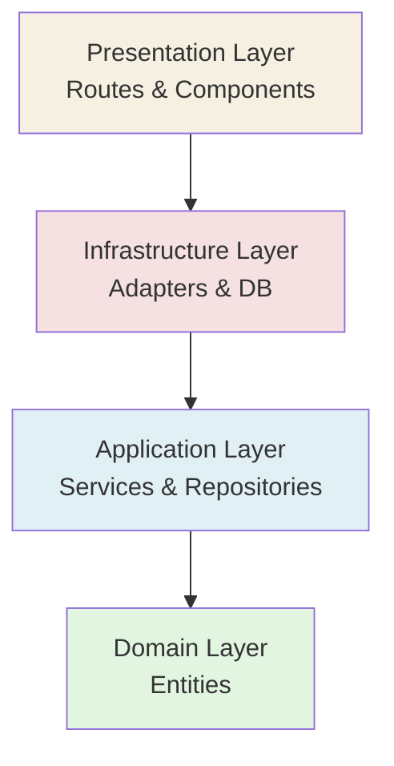
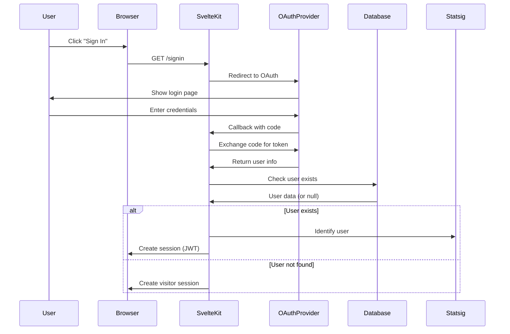
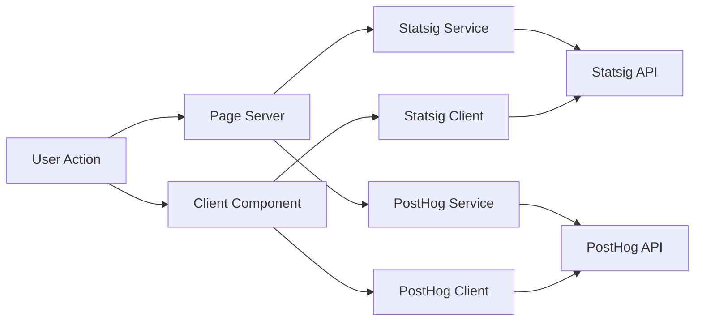
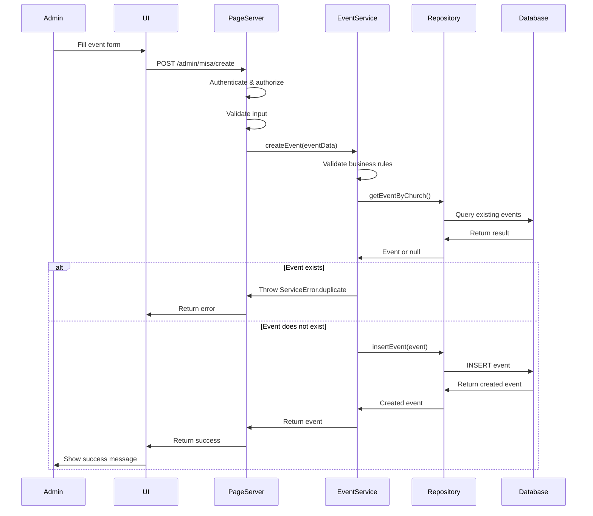
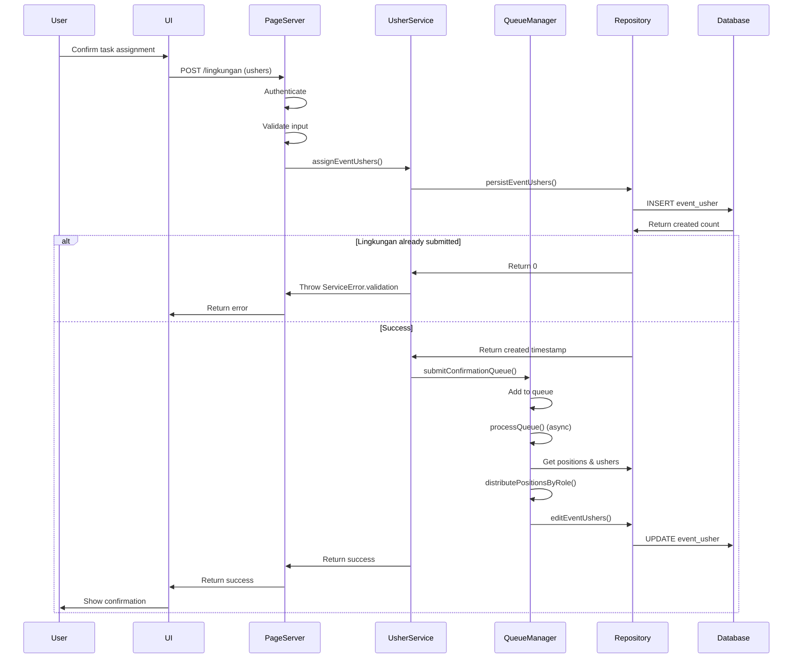
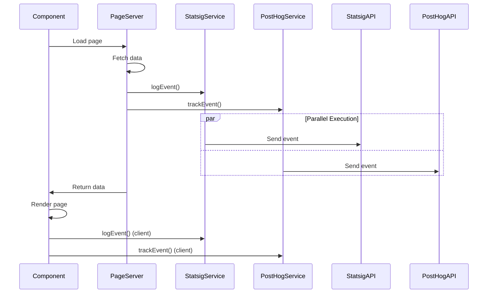

# Design Document

## System Architecture Overview

Lilium Inter Spinas follows Clean Architecture principles, ensuring separation of concerns, testability, and maintainability. The system is built with SvelteKit 5, TypeScript, and SQLite, implementing a layered architecture with clear dependency boundaries.

### Architecture Layers

The system is organized into five distinct layers, with dependencies flowing inward:

```
┌─────────────────────────────────────────────────────────┐
│                  Presentation Layer                      │
│              (routes/, components/)                      │
│         - SvelteKit routes and components                │
│         - HTTP request/response handling                 │
└──────────────────┬──────────────────────────────────────┘
                   │ depends on
┌──────────────────┴──────────────────────────────────────┐
│              Infrastructure Layer                        │
│         (lib/server/adapters/)                          │
│         - Database adapters (SQLite)                    │
│         - External service integrations                  │
└──────────────────┬──────────────────────────────────────┘
                   │ implements
┌──────────────────┴──────────────────────────────────────┐
│            Application Layer                             │
│      (core/service/, core/repositories/)                │
│         - Business logic services                        │
│         - Repository interfaces (ports)                  │
└──────────────────┬──────────────────────────────────────┘
                   │ uses
┌──────────────────┴──────────────────────────────────────┐
│                Domain Layer                              │
│              (core/entities/)                           │
│         - Domain entities and models                     │
│         - Business rules and validations                 │
└──────────────────────────────────────────────────────────┘
```

### Dependency Flow

Dependencies point inward: outer layers depend on inner layers, but inner layers never depend on outer layers.



### Technology Stack

- **Frontend Framework**: SvelteKit 5 with Svelte 5 runes
- **Language**: TypeScript (strict mode)
- **Database**: SQLite with Drizzle ORM
- **Authentication**: @auth/sveltekit with OAuth providers (Microsoft Entra ID, Google)
- **Styling**: Tailwind CSS with Flowbite components
- **Analytics**: Statsig (feature gate) and PostHog (product, user analytics, feature flags, A/B testing)
- **Logging**: Pino (structured logging)
- **Testing**: Vitest (unit tests), Playwright (integration tests)

## Architecture Layers

### Domain Layer (`core/entities/`)

The domain layer contains pure business entities with no external dependencies.

#### Entity Definitions

**Core Entities:**
- `ChurchEvent`: Represents church events (mass/feast)
- `EventUsher`: Represents usher assignments to events
- `Mass`: Represents mass service configurations
- `Church`: Represents church/parish information
- `ChurchZone`: Represents zone organization
- `ChurchPosition`: Represents positions within zones
- `Wilayah`: Represents regional organization
- `Lingkungan`: Represents communities within regions
- `User`: Represents system users

#### Entity Structure Example

```typescript
export interface ChurchEvent {
  id: string;
  church: string;
  churchCode?: string | null;
  mass: string;
  massId?: string | null;
  date: string;
  weekNumber?: number | null;
  createdAt?: number | null;
  isComplete?: number | null; // 100% assigned ushers
  active?: number | null;
  type?: EventType | null;
  code?: string | null;
  description?: string | null;
}

export enum EventType {
  MASS = 'mass',
  FEAST = 'feast'
}
```

**Key Principles:**
- Entities contain no business logic, only data structures
- No dependencies on other layers
- Pure TypeScript interfaces and types
- Business rules are enforced in the service layer

### Application Layer (`core/service/`, `core/repositories/`)

The application layer contains business logic and defines contracts for data access.

#### Service Classes

**EventService** (`core/service/EventService.ts`):
- Manages church event operations
- Orchestrates event creation, retrieval, and updates
- Handles week-based event queries
- Coordinates with UsherService for usher-related operations

**UsherService** (`core/service/UsherService.ts`):
- Manages usher assignment operations
- Retrieves usher assignments by event
- Handles usher assignment persistence
- Validates usher assignments

**ChurchService** (`core/service/ChurchService.ts`):
- Manages church-related data (zones, masses, regions)
- Provides access to church configuration
- Handles wilayah and lingkungan data

**QueueManager** (`core/service/QueueManager.ts`):
- Singleton service for processing usher assignment queues
- Implements position distribution algorithms (round-robin, sequential)
- Handles role-based constraints (PPG vs non-PPG)
- Processes confirmation queues from communities

**AuthService** (`core/service/AuthService.ts`):
- Handles authentication-related business logic
- Manages user role verification

#### Repository Interfaces

Repository interfaces (ports) define contracts for data access:

```typescript
export interface ScheduleRepository {
  // Event operations
  insertEvent(event: ChurchEvent): Promise<ChurchEvent>;
  getEventById(id: string): Promise<ChurchEvent>;
  updateEventById(eventId: string, event: ChurchEvent): Promise<ChurchEvent>;
  listEventsByWeekNumber(
    churchId: string,
    weekNumbers: number[],
    isToday: boolean,
    limit?: number
  ): Promise<ChurchEvent[]>;
  
  // Usher operations
  listUsherByEvent(eventId: string): Promise<UsherResponse[]>;
  persistEventUshers(
    eventId: string,
    ushers: EventUsher[],
    wilayahId: string,
    lingkunganId: string
  ): Promise<number>;
  
  // ... other operations
}
```

**Key Principles:**
- Interfaces define contracts, not implementations
- Services depend on interfaces, not concrete implementations
- Enables dependency inversion and testability

### Infrastructure Layer (`lib/server/adapters/`)

The infrastructure layer implements repository interfaces using specific technologies.

#### Adapter Implementation

**SQLiteAdapter** (`lib/server/adapters/SQLiteAdapter.ts`):
- Implements `ScheduleRepository` interface
- Delegates to database-specific functions
- Provides abstraction over SQLite implementation

**Structure:**
```
lib/server/adapters/
├── SQLiteAdapter.ts          # Main adapter implementing ScheduleRepository
├── SQLiteDbEvent.ts          # Event-related database operations
├── SQLiteDbFacility.ts       # Church, zone, position operations
├── SQLiteDbMass.ts           # Mass-related operations
├── SQLiteDbRegion.ts         # Wilayah, lingkungan operations
└── SQLiteDbUser.ts           # User operations
```

**Example Implementation:**

```typescript
export class SQLiteAdapter implements ScheduleRepository {
  private db: ReturnType<typeof drizzle>;

  constructor(db: ReturnType<typeof drizzle>) {
    this.db = db;
  }

  getEventById = (id: string) => findEventById(this.db, id);
  insertEvent = (event: ChurchEvent) => createEvent(this.db, event);
  listEventsByWeekNumber = (
    churchId: string,
    weekNumbers: number[],
    isToday: boolean,
    limit?: number
  ) => listEventsByWeekNumber(this.db, churchId, weekNumbers, isToday, limit);
}
```

**Key Principles:**
- One adapter per technology (SQLite, PostgreSQL, etc.)
- Database-specific code isolated in adapter
- Easy to swap implementations without changing business logic

### Presentation Layer (`routes/`)

The presentation layer handles HTTP requests, form actions, and UI rendering.

#### Route Structure

```
routes/
├── +layout.server.ts          # Root layout with auth
├── +layout.svelte             # Root layout component
├── +page.server.ts            # Home page server logic
├── +page.svelte               # Home page component
├── admin/
│   ├── +layout.server.ts      # Admin layout with role check
│   ├── jadwal/                # Schedule management
│   └── misa/                  # Event management
├── f/                         # Public routes
│   ├── tatib/                 # Public task confirmation
│   └── petunjuk/              # Guidelines
├── lingkungan/                # Community routes
├── signin/                    # Authentication
└── signout/                   # Sign out
```

#### Server-Side Pattern

**Load Function Pattern:**

```typescript
export const load: PageServerLoad = async (event) => {
  // 1. Authenticate and authorize
  const session = await event.locals.auth();
  if (!session || !hasRole(session, 'admin')) {
    throw redirect(302, '/signin');
  }

  // 2. Initialize services
  const churchId = session.user?.cid;
  const eventService = new EventService(churchId);

  // 3. Fetch data
  const events = await eventService.retrieveEventsByWeekRange({
    weekNumber: getWeekNumber(),
    isToday: true
  });

  // 4. Track analytics
  await statsigService.logEvent('admin_jadwal_view', 'load', session);

  // 5. Return data
  return { events, session };
};
```

**Form Action Pattern:**

```typescript
export const actions: Actions = {
  default: async ({ request, locals }: RequestEvent) => {
    // 1. Authenticate
    const session = await locals.auth();
    if (!hasRole(session, 'admin')) {
      return fail(403, { error: 'Unauthorized' });
    }

    // 2. Validate input
    const formData = await request.formData();
    const date = formData.get('date') as string;
    if (!date) {
      return fail(400, { error: 'Date is required' });
    }

    // 3. Process with service
    const eventService = new EventService(session.user?.cid);
    const event = await eventService.createEvent(eventData);

    // 4. Return result
    return { success: true, event };
  }
};
```

#### Client-Side Pattern (Svelte 5)

**Component Structure:**

```svelte
<script lang="ts">
  // 1. Imports
  import { enhance } from '$app/forms';
  import { page } from '$app/state';
  import type { PageProps } from './$types';

  // 2. Props
  const { data, form } = $props<{
    data: PageProps['data'];
    form: PageProps['form'];
  }>();

  // 3. State
  let selectedDate = $state<Date | undefined>(undefined);
  let isSubmitting = $state(false);

  // 4. Derived
  const events = $derived(data.events || []);

  // 5. Functions
  function handleDateSelect(date: Date) {
    selectedDate = date;
  }

  // 6. Effects
  $effect(() => {
    // Reactive side effects
  });
</script>

<!-- Template -->
```

## Database Design

### Entity Relationship Diagram

See `doc/ERD.mermaid` for complete ERD. Key relationships:

- User → Church (belongs_to)
- User → Lingkungan (assigned_to)
- Church → Mass (hosts)
- Church → ChurchZone (organizes)
- ChurchZone → ChurchPosition (defines)
- Church → Wilayah (covers)
- Wilayah → Lingkungan (contains)
- Church → ChurchEvent (schedules)
- ChurchEvent → EventUsher (assigns)

### Schema Definitions

Schema is defined in `src/lib/server/db/schema.ts` using Drizzle ORM:

```typescript
export const event = sqliteTable('event', {
  id: text('id').primaryKey().unique().notNull(),
  church_id: text('church_id')
    .references(() => church.id, { onDelete: 'cascade' })
    .notNull(),
  mass_id: text('mass_id')
    .references(() => mass.id, { onDelete: 'cascade' })
    .notNull(),
  date: text('date').notNull(),
  week_number: integer('week_number'),
  created_at: integer('created_at').default(sql`(unixepoch())`),
  is_complete: integer('is_complete').notNull().default(0),
  active: integer('active').notNull().default(1),
  type: text('type', { enum: ['mass', 'feast'] }).notNull().default('mass'),
  code: text('code'),
  description: text('description')
});
```

### Migration Strategy

1. **Schema Changes**: Update `schema.ts` with changes
2. **Generate Migration**: `npm run db:generate` creates migration files
3. **Review Migration**: Review generated SQL in `drizzle/` directory
4. **Apply Migration**: `npm run db:migrate` applies migrations
5. **Custom Migrations**: Use `npm run db:migrate:custom` for programmatic migrations

**Important**: Never edit migration files manually. Always regenerate if changes are needed.

### Indexing Strategy

- Primary keys are automatically indexed
- Foreign keys should be indexed for join performance
- Frequently queried columns (church_id, event date, week_number) should have indexes
- Composite indexes for common query patterns (church_id + week_number)

## Key Design Patterns

### Repository Pattern

The Repository pattern abstracts data access logic and provides a collection-like interface.

**Benefits:**
- Decouples business logic from data access
- Enables swapping implementations (SQLite → PostgreSQL)
- Simplifies testing with mock repositories

**Implementation:**
1. Define interface in `core/repositories/`
2. Implement interface in `lib/server/adapters/`
3. Inject implementation into services

### Service Layer Pattern

Services encapsulate business logic and coordinate between repositories.

**EventService Example:**

```typescript
export class EventService {
  constructor(private churchId: string) {
    this.usherService = new UsherService(churchId);
  }

  async createEvent(newEvent: ChurchEvent): Promise<ChurchEvent> {
    // 1. Validate business rules
    if (!newEvent.church) {
      throw ServiceError.validation('Church ID is required');
    }

    // 2. Check for duplicates
    const existing = await repo.getEventByChurch(
      this.churchId,
      newEvent.mass,
      newEvent.date
    );
    if (existing) {
      throw ServiceError.duplicate('Event already exists');
    }

    // 3. Persist
    return await repo.insertEvent(newEvent);
  }
}
```

### Adapter Pattern

Adapters implement repository interfaces using specific technologies.

**Benefits:**
- Technology-agnostic business logic
- Easy to add new database implementations
- Clear separation of concerns

### Error Handling Pattern (ServiceError)

Centralized error handling with typed errors:

```typescript
export enum ServiceErrorType {
  VALIDATION_ERROR = 'VALIDATION_ERROR',
  DUPLICATE_ERROR = 'DUPLICATE_ERROR',
  DATABASE_ERROR = 'DATABASE_ERROR',
  NOT_FOUND_ERROR = 'NOT_FOUND_ERROR',
  UNKNOWN_ERROR = 'UNKNOWN_ERROR'
}

export class ServiceError extends Error {
  type: ServiceErrorType;
  details?: Record<string, unknown>;

  static validation(message: string, details?: Record<string, unknown>): ServiceError {
    return new ServiceError(message, ServiceErrorType.VALIDATION_ERROR, details);
  }

  static notFound(message: string, details?: Record<string, unknown>): ServiceError {
    return new ServiceError(message, ServiceErrorType.NOT_FOUND_ERROR, details);
  }
}
```

**Usage:**

```typescript
try {
  const event = await repo.findEventById(id);
  if (!event) {
    throw ServiceError.notFound('Event not found', { id });
  }
  return event;
} catch (error) {
  if (error instanceof ServiceError) {
    throw error; // Re-throw domain errors
  }
  throw ServiceError.database('Failed to retrieve event', { originalError: error });
}
```

### Dependency Injection

Services receive dependencies (repositories) through constructor injection:

```typescript
export class EventService {
  constructor(
    private churchId: string,
    private repo: ScheduleRepository = repo // Default to singleton, can be overridden for testing
  ) {}
}
```

**Testing Benefits:**
- Easy to mock dependencies
- No hidden dependencies
- Clear dependency graph

### Singleton Pattern

**QueueManager** uses singleton pattern for global state management:

```typescript
export class QueueManager {
  private static instance: QueueManager;

  private constructor() {
    // Private constructor
  }

  public static getInstance(): QueueManager {
    if (!QueueManager.instance) {
      QueueManager.instance = new QueueManager();
    }
    return QueueManager.instance;
  }
}
```

## Authentication & Authorization Design

### OAuth Flow



### Session Management

Sessions use JWT tokens managed by `@auth/sveltekit`:

1. **JWT Callback**: Validates user, checks registration status, assigns role
2. **Session Callback**: Adds user info to session object
3. **Cookie Storage**: Secure HTTP-only cookies
4. **Expiration**: Configurable session maxAge

### Role Verification

Role checking functions:

```typescript
export function hasRole(session: Session | null, requiredRole: UserRole): boolean {
  if (!session?.user?.role) return false;
  
  const roleHierarchy: Record<UserRole, number> = {
    visitor: 0,
    user: 1,
    admin: 2
  };
  
  return roleHierarchy[session.user.role] >= roleHierarchy[requiredRole];
}

export function requireRole(session: Session | null, requiredRole: UserRole): void {
  if (!hasRole(session, requiredRole)) {
    throw error(403, 'Forbidden');
  }
}
```

## Core Algorithms

### Usher Position Assignment Algorithm

The QueueManager implements a constrained bipartite matching problem with role-based constraints.

**Algorithm Steps:**

1. **Separate ushers by role**: PPG vs non-PPG
2. **Separate positions by type**: PPG vs non-PPG
3. **Filter available positions**: Exclude already assigned
4. **Apply distribution strategy**:
   - **Round-robin**: Cyclic assignment with rotation tracking
   - **Sequential**: First-come-first-served until exhaustion
5. **Assign positions**: Respect role constraints
6. **Update database**: Persist assignments

**Complexity**: O(|E| × |U| × |P|) where E=events, U=ushers, P=positions

**Implementation Location**: `src/core/service/QueueManager.ts`

### Week Number Calculation

ISO 8601 week number calculation with year boundary handling:

```typescript
export function getWeekNumber(date?: string): number {
  // Week 1 is the first week with at least 4 days of the year
  // Handles year boundaries correctly
}
```

**Edge Cases:**
- Week 52/53 → Week 1 (year boundary)
- First week with < 4 days belongs to previous year
- Last week with < 4 days belongs to next year

**Implementation Location**: `src/lib/utils/dateUtils.ts`

### Event Completion Tracking

Completion is calculated based on assignment percentage:

```
completion = (assigned_ushers / total_positions) × 100
isComplete = completion === 100 ? 1 : 0
```

**Implementation**: Database view or computed in service layer

## Integration Architecture

### Statsig Integration

**Purpose**: Feature flags, A/B testing, key event tracking

**Implementation**: `src/lib/application/StatsigService.ts`

**Features:**
- Feature gate checking
- User identification
- Event logging with metadata
- Server-side and client-side support
- Session replay (browser only)
- Auto-capture analytics (browser only)

**Feature Gates Used:**
- `ppg`: Enables PPG (special role) position assignment in usher scheduling
- `round_robin`: Enables round-robin distribution algorithm for usher position assignment (vs sequential)
- `no_saturday_sunday`: Restricts form submissions and event creation to weekdays only (Monday-Friday)

**Usage:**

```typescript
// Check feature gate
const isPpgEnabled = await statsigService.checkGate('ppg');
const isRoundRobinEnabled = await statsigService.checkGate('round_robin');
const isNoSaturdaySunday = await statsigService.checkGate('no_saturday_sunday');

// Log event
await statsigService.logEvent('event_created', 'action', session, {
  event_id: event.id,
  event_type: event.type
});

// Identify user
await statsigService.updateUser(userId, {
  email: user.email,
  role: user.role,
  cid: churchId
});
```

### PostHog Integration

**Purpose**: User analytics, session replay, business metrics

**Implementation**: `src/lib/application/PostHogService.ts`

**Features:**
- Automatic pageview tracking
- Automatic click tracking (autocapture)
- Custom event tracking
- User identification
- Session replay

**Usage:**

```typescript
// Track custom event
await posthogService.trackEvent('admin_jadwal_filter_change', {
  filter_type: filter,
  filtered_count: count
}, session);

// Track pageview
await posthogService.trackPageView(routeId, {
  url: page.url.href
}, session);
```

### Analytics Event Flow



**Dual Tracking Strategy:**
- **Statsig**: Key business events, feature flag events, server-side events
- **PostHog**: User interactions, business context, client-side events, autocapture

## Security Design

### Input Validation

All user inputs are validated before processing:

```typescript
// Server-side validation
const date = formData.get('date') as string;
if (!date || typeof date !== 'string') {
  return fail(400, { error: 'Date is required' });
}

// Validate format
const dateObj = new Date(date);
if (isNaN(dateObj.getTime())) {
  return fail(400, { error: 'Invalid date format' });
}
```

### SQL Injection Prevention

All database queries use Drizzle ORM's parameterized queries:

```typescript
// ✅ Safe: Parameterized query
const result = await db
  .select()
  .from(event)
  .where(eq(event.id, eventId))
  .limit(1);

// ❌ Never use: String interpolation
const query = `SELECT * FROM event WHERE id = '${eventId}'`; // UNSAFE!
```

### XSS Prevention

Svelte automatically escapes content in templates:

```svelte
<!-- ✅ Safe: Automatic escaping -->
<p>{userInput}</p>

<!-- ⚠️ Only use if necessary and sanitized -->
{@html sanitizeHtml(userInput)}
```

### CSRF Protection

SvelteKit provides built-in CSRF protection for form actions:

- Automatic CSRF token generation
- Token validation on form submissions
- No additional configuration needed

### Session Security

**Cookie Attributes:**
- `httpOnly: true` - Prevents JavaScript access
- `sameSite: 'strict'` - CSRF protection
- `secure: true` - HTTPS only (production)
- `maxAge` - Session expiration

### Environment Variable Security

**Critical Rule**: Never use `VITE_` prefix for secrets (exposed to client)

```typescript
// ❌ Bad: Exposed to client
const secret = import.meta.env.VITE_AUTH_SECRET;

// ✅ Good: Server-only
const secret = process.env.AUTH_SECRET; // In .server.ts files
```

### HTTP Security Headers

Implemented in `src/hooks.server.ts`:

```typescript
response.headers.set('Content-Security-Policy', '...');
response.headers.set('X-Frame-Options', 'DENY');
response.headers.set('X-Content-Type-Options', 'nosniff');
response.headers.set('Strict-Transport-Security', 'max-age=31536000');
response.headers.set('Referrer-Policy', 'strict-origin-when-cross-origin');
```

## Data Flow Diagrams

### Event Creation Flow



### Usher Assignment Flow



### Authentication Flow

See "Authentication & Authorization Design" section above.

### Analytics Tracking Flow



## API Design

### Route Structure

Routes follow SvelteKit conventions:

- `+page.server.ts`: Server-side load functions and form actions
- `+page.svelte`: Client-side components
- `+layout.server.ts`: Layout-level server logic
- `+layout.svelte`: Layout components

### Form Actions Pattern

All state-changing operations use SvelteKit form actions:

```typescript
// +page.server.ts
export const actions: Actions = {
  default: async ({ request, locals }) => {
    // 1. Authenticate
    // 2. Validate
    // 3. Process
    // 4. Return result
    return { success: true, data: result };
  }
};
```

### Load Function Pattern

Data fetching uses load functions:

```typescript
export const load: PageServerLoad = async (event) => {
  // 1. Authenticate
  // 2. Fetch data
  // 3. Track analytics
  // 4. Return data
  return { data };
};
```

### Error Response Format

Consistent error response format:

```typescript
// Success
return { success: true, data: result };

// Validation error
return fail(400, { error: 'Validation error message' });

// Authorization error
return fail(403, { error: 'Unauthorized' });

// ServiceError (thrown, caught, converted)
catch (error) {
  if (error instanceof ServiceError) {
    return fail(400, { error: error.message });
  }
  return fail(500, { error: 'Internal server error' });
}
```

## Frontend Architecture

### Svelte 5 Runes

The application uses Svelte 5 runes for reactivity:

**$props()**: Component props
```typescript
const { data, form } = $props<{
  data: PageData;
  form: PageForm;
}>();
```

**$state()**: Reactive state
```typescript
let selectedDate = $state<Date | undefined>(undefined);
let isSubmitting = $state(false);
```

**$derived()**: Computed values
```typescript
const filteredEvents = $derived(
  events.filter(e => e.date >= selectedDate)
);
```

**$effect()**: Side effects
```typescript
$effect(() => {
  if (selectedDate) {
    // Reactive side effect
  }
});
```

**$bindable()**: Two-way binding
```typescript
let { value = $bindable<Date>() } = $props();
```

### Component Structure

**Standard Component Template:**

```svelte
<script lang="ts">
  // 1. Imports (external → internal → aliases)
  import { enhance } from '$app/forms';
  import type { PageProps } from './$types';

  // 2. Props
  const { data, form } = $props<PageProps>();

  // 3. State
  let isSubmitting = $state(false);

  // 4. Derived
  const events = $derived(data.events || []);

  // 5. Functions
  function handleSubmit() {
    // Handler logic
  }

  // 6. Effects
  $effect(() => {
    // Side effects
  });
</script>

<!-- Template -->
```

### State Management

- **Component State**: Use `$state()` for local component state
- **Shared State**: Use Svelte stores (when needed) or prop drilling
- **Server State**: Fetched in load functions, passed as props
- **Form State**: Managed by SvelteKit form actions

### Reactive Patterns

**Reactive Tracking:**

```typescript
$effect(() => {
  // Runs when dependencies change
  const session = page.data.session;
  if (session) {
    // Track analytics
  }
});
```

**Reactive Filtering:**

```typescript
const filteredEvents = $derived(() => {
  return events.filter(e => {
    if (filter === 'all') return true;
    return e.status === filter;
  });
});
```

## Testing Strategy

### Unit Testing

**Framework**: Vitest

**Location**: `*.test.ts` files alongside source files

**Pattern:**

```typescript
import { describe, it, expect, beforeEach, vi } from 'vitest';
import { EventService } from './EventService';

describe('EventService', () => {
  let eventService: EventService;
  const mockRepo = {
    insertEvent: vi.fn(),
    getEventById: vi.fn()
  };

  beforeEach(() => {
    eventService = new EventService('church-1', mockRepo);
  });

  it('should create event successfully', async () => {
    const mockEvent = { id: '1', church: 'church-1', ... };
    vi.mocked(mockRepo.insertEvent).mockResolvedValue(mockEvent);

    const result = await eventService.createEvent(mockEvent);

    expect(mockRepo.insertEvent).toHaveBeenCalledWith(mockEvent);
    expect(result).toEqual(mockEvent);
  });
});
```

### Integration Testing

**Framework**: Playwright

**Location**: `tests/` directory

**Pattern:**

```typescript
import { test, expect } from '@playwright/test';

test.describe('Event Management', () => {
  test('should create new event', async ({ page }) => {
    await page.goto('/admin/misa/create');
    await page.fill('input[name="date"]', '2024-12-25');
    await page.click('button[type="submit"]');
    await expect(page.locator('.alert-success')).toBeVisible();
  });
});
```

### Test Organization

- **Unit Tests**: Co-located with source files (`*.test.ts`)
- **Integration Tests**: In `tests/` directory
- **Test Utilities**: Shared mocks and fixtures
- **Coverage**: Aim for high coverage of business logic

## File Organization

### Directory Structure

```
src/
├── core/                      # Domain & Application layers
│   ├── entities/             # Domain entities
│   ├── repositories/         # Repository interfaces (ports)
│   ├── service/              # Business logic services
│   └── errors/               # Domain errors
├── lib/                      # Infrastructure & utilities
│   ├── application/          # Application services (analytics, etc.)
│   ├── components/           # Reusable UI components
│   ├── server/               # Server-side code
│   │   ├── adapters/         # Repository implementations
│   │   └── db/               # Database configuration
│   └── utils/                # Utility functions
├── routes/                   # Presentation layer (SvelteKit routes)
│   ├── admin/                # Admin routes
│   ├── f/                    # Public routes
│   └── lingkungan/           # Community routes
└── types/                    # TypeScript type definitions
```

### Naming Conventions

- **Files**: PascalCase for classes, camelCase for utilities
- **Directories**: kebab-case or camelCase
- **Components**: PascalCase (matches file name)
- **Services**: PascalCase with "Service" suffix
- **Repositories**: PascalCase with "Repository" suffix
- **Adapters**: PascalCase with "Adapter" suffix

See `doc/NamingGuidelines.md` for detailed naming conventions.
