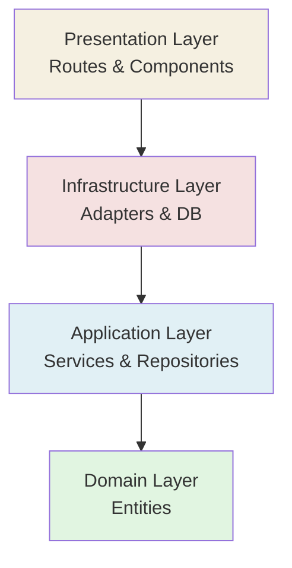
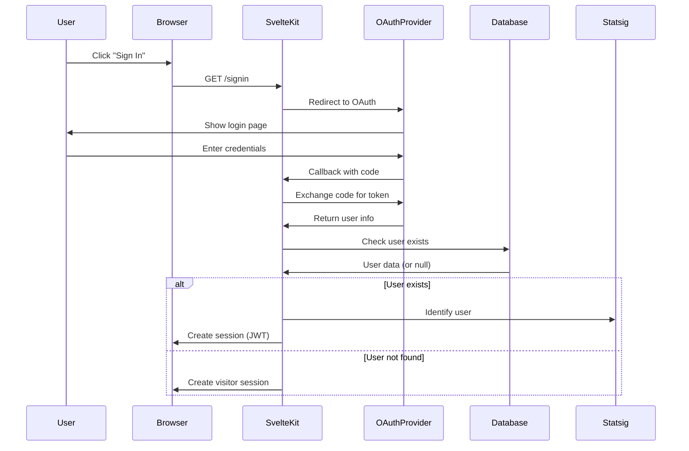
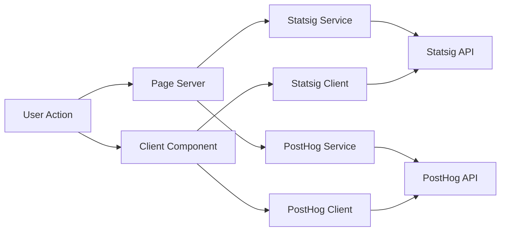
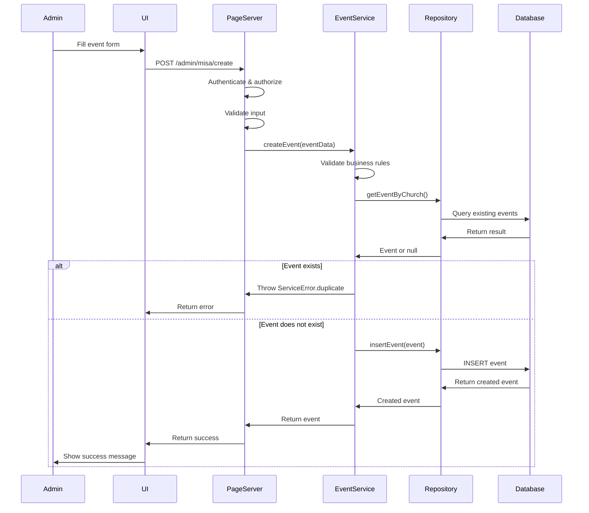
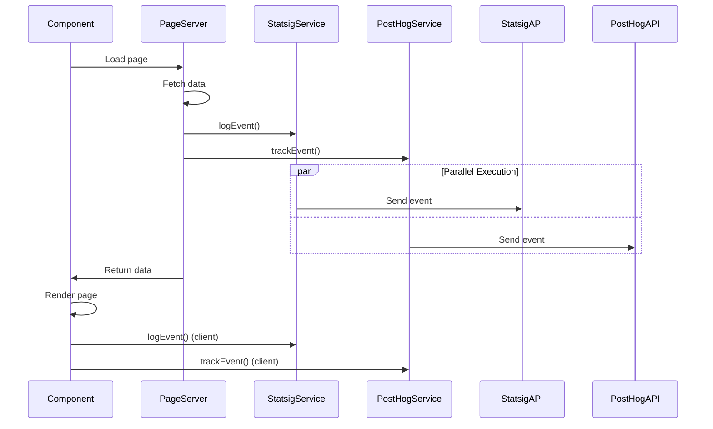

# Design Document

## System Architecture Overview

Lilium Inter Spinas follows Clean Architecture principles, ensuring separation of concerns, testability, and maintainability. The system is built with SvelteKit 5, TypeScript, and SQLite, implementing a layered architecture with clear dependency boundaries.

### Architecture Layers

The system is organized into five distinct layers, with dependencies flowing inward:

```
┌─────────────────────────────────────────────────────────┐
│                  Presentation Layer                      │
│              (routes/, components/)                      │
│         - SvelteKit routes and components                │
│         - HTTP request/response handling                 │
└──────────────────┬──────────────────────────────────────┘
                   │ depends on
┌──────────────────┴──────────────────────────────────────┐
│              Infrastructure Layer                        │
│         (lib/server/adapters/)                          │
│         - Database adapters (SQLite)                    │
│         - External service integrations                  │
└──────────────────┬──────────────────────────────────────┘
                   │ implements
┌──────────────────┴──────────────────────────────────────┐
│            Application Layer                             │
│      (core/service/, core/repositories/)                │
│         - Business logic services                        │
│         - Repository interfaces (ports)                  │
└──────────────────┬──────────────────────────────────────┘
                   │ uses
┌──────────────────┴──────────────────────────────────────┐
│                Domain Layer                              │
│              (core/entities/)                           │
│         - Domain entities and models                     │
│         - Business rules and validations                 │
└──────────────────────────────────────────────────────────┘
```

### Dependency Flow

Dependencies point inward: outer layers depend on inner layers, but inner layers never depend on outer layers.


```mermaid
graph TB
    Presentation[Presentation Layer<br/>Routes & Components] --> Infrastructure[Infrastructure Layer<br/>Adapters & DB]
    Infrastructure --> Application[Application Layer<br/>Services & Repositories]
    Application --> Domain[Domain Layer<br/>Entities]
    
    style Domain fill:#e1f5e1
    style Application fill:#e1f0f5
    style Infrastructure fill:#f5e1e1
    style Presentation fill:#f5f0e1
```

### Technology Stack

- **Frontend Framework**: SvelteKit 5 with Svelte 5 runes
- **Language**: TypeScript (strict mode)
- **Database**: SQLite with Drizzle ORM
- **Authentication**: @auth/sveltekit with OAuth providers (Microsoft Entra ID, Google)
- **Styling**: Tailwind CSS with Flowbite components
- **Analytics**: Statsig (feature gate) and PostHog (product, user analytics, feature flags, A/B testing)
- **Logging**: Pino (structured logging)
- **Testing**: Vitest (unit tests), Playwright (integration tests)

## Architecture Layers

### Domain Layer (`core/entities/`)

The domain layer contains pure business entities with no external dependencies.

#### Entity Definitions

**Core Entities — Territorial hierarchy (WHERE, territorial):**
- `Parish`: Administrative root; owns Wilayahs and Churches
- `Wilayah`: Canonical Indonesian Catholic territorial unit (proper noun)
- `Community`: Neighbourhood community (was: *Lingkungan*); UI label stays *Lingkungan*
- `Parishioner`: Person attached to a Community; stable identity for roster assignments

**Core Entities — Physical hierarchy (WHERE, physical):**
- `Church`: Physical building belonging to a Parish
- `Section`: Named part of a building (was: `ChurchZoneGroup`)
- `Zone`: Service area within a Section (was: `ChurchZone`)
- `Station`: Specific assignment point within a Zone (was: `ChurchPosition`); Indonesian: *Pos*

**Core Entities — Liturgy (WHAT × WHEN):**
- `MassSchedule`: Recurring liturgy template (was: `Mass`)
- `Celebration`: Concrete dated instance of a liturgy (was: `ChurchEvent`); Indonesian: *Perayaan*
- `LiturgyKind`: Enum — `Mass`, `Adoration`, `Vespers`, … (replaces `EventType.MASS | FEAST`)
- `LiturgicalRank`: Enum — `Solemnity`, `Feast`, `Memorial`, `Weekday`

**Core Entities — Ministries (WHO, liturgical service):**
- `Ministry`: Type-Object catalog entry — `Usher`, `PETA`, `EMHC`, `AltarServer`, …
- `MinistryRole`: Sub-catalog within a ministry — `Regular`, `Kolekte`, `PPG`, `PPKG`, `Processional`
- `Roster`: Aggregate root for one Celebration's assignments; lifecycle `draft → submitted → confirmed`
- `RosterEntry`: One Community's commitment to one Celebration (child of `Roster`)
- `RosterUsher`: One minister's station assignment within a `RosterEntry` (was: `EventUsher`)

**Core Entities — Affiliations (WHO, governance):**
- `Committee`: Governance catalog — `PPG`, `PPKG`, `DPP`, …
- `CommitteeMembership`: Parishioner × Committee with date range
- `User`: System user (authentication/authorisation)

#### Entity Structure Example

```typescript
// src/core/entities/Liturgy.ts

/** Concrete dated instance of a liturgy (was: ChurchEvent). Indonesian: Perayaan. */
export interface Celebration {
  readonly id: string;
  readonly churchId: string;
  readonly massScheduleId: string | null;  // null for one-off celebrations
  readonly date: string;
  readonly weekNumber: number | null;
  readonly liturgyKind: LiturgyKind;
  readonly liturgicalRank: LiturgicalRank | null;
  readonly createdAt: number | null;
  readonly active: number | null;
  readonly code: string | null;
  readonly description: string | null;
}

/** What is celebrated — orthogonal to rank and cadence. Replaces EventType.MASS | FEAST. */
export enum LiturgyKind {
  Mass = 'mass',
  Adoration = 'adoration',
  Vespers = 'vespers',
  StationsOfCross = 'stations_of_cross',
}

/** The Church's importance classification for this celebration. */
export enum LiturgicalRank {
  Solemnity = 'solemnity',
  Feast = 'feast',
  Memorial = 'memorial',
  Weekday = 'weekday',
}
```

**Key Principles:**
- Entities contain no business logic, only data structures
- No dependencies on other layers
- Pure TypeScript interfaces and types
- Business rules are enforced in the service layer

### Application Layer (`core/service/`, `core/repositories/`)

The application layer contains business logic and defines contracts for data access.

#### Service Classes

**EventService** (`core/service/EventService.ts`):
- Manages `Celebration` (formerly `ChurchEvent`) CRUD operations
- Orchestrates creation, retrieval, and updates
- Handles week-based celebration queries

**RosterService** (`core/service/RosterService.ts`):
- Aggregate root service for the Roster lifecycle
- `createRoster(cmd)` — PETA assigns Communities to a Celebration
- `submitEntry(cmd)` — Community submits usher names; status `draft → submitted`
- `confirmEntry(cmd)` — PETA confirms + triggers station distribution; status `submitted → confirmed`
- `applyTransition(entry, transition)` — pure state-machine function; no I/O; fully unit-testable

**ChurchService** (`core/service/ChurchService.ts`):
- `retrieveParishHierarchy(parishId)` — pre-loads `Parish → Wilayah → Community` tree
- `retrieveChurchFacility(churchId)` — pre-loads `Church → Section → Zone → Station` tree
- Avoids N+1 queries in roster and schedule pages

**MinistryService** (`core/service/MinistryService.ts`):
- Thin catalog service over `Ministry` and `MinistryRole` tables
- `listMinistries()`, `listRolesByMinistry(ministryId)`, `findRoleByCode(code)`
- Used by `RosterService` for role resolution at assignment time

**QueueManager** (`core/service/QueueManager.ts`):
- Singleton service for processing station-distribution queues
- Implements distribution strategies (round-robin, sequential)
- Reads `MinistryRole.code` to apply role-based constraints (replaces PPG/Kolekte boolean flags)
- Processes confirmation queues from communities

**AuthService** (`core/service/AuthService.ts`):
- Handles authentication-related business logic
- Manages user role verification

#### Repository Interfaces

Repository interfaces (ports) define contracts for data access. Following the Clean Architecture split in `design-pattern.md`, there are four domain-specific repositories rather than one monolithic `ScheduleRepository`:

```typescript
// src/core/repositories/ParishRepository.ts
export interface ParishRepository {
  findParishHierarchy(parishId: string): Promise<ParishHierarchy>;
  listCommunities(wilayahId: string): Promise<Community[]>;
  findCommunityById(communityId: string): Promise<Community | null>;
}

// src/core/repositories/FacilityRepository.ts
export interface FacilityRepository {
  findChurchFacility(churchId: string): Promise<ChurchFacility>;
  listStationsByZone(zoneId: string): Promise<Station[]>;
  listZonesByMass(massScheduleId: string): Promise<Zone[]>;
}

// src/core/repositories/MinistryRepository.ts
export interface MinistryRepository {
  listMinistries(): Promise<Ministry[]>;
  listRolesByMinistry(ministryId: string): Promise<MinistryRole[]>;
  findRoleByCode(code: string): Promise<MinistryRole | null>;
}

// src/core/repositories/RosterRepository.ts
export interface RosterRepository {
  createRoster(cmd: CreateRosterCommand): Promise<Roster>;
  loadRoster(eventId: string): Promise<Roster | null>;
  submitEntry(cmd: SubmitRosterEntryCommand): Promise<RosterEntry>;
  confirmEntry(cmd: ConfirmRosterEntryCommand): Promise<RosterEntry>;
  reopenEntry(rosterId: string, communityId: string): Promise<RosterEntry>;
  listByCommunity(communityId: string): Promise<Roster[]>;
}
```

**Key Principles:**
- Interfaces define contracts, not implementations
- Services depend on interfaces, not concrete implementations
- Enables dependency inversion and testability

### Infrastructure Layer (`lib/server/adapters/`)

The infrastructure layer implements repository interfaces using specific technologies.

#### Adapter Implementation

**SQLiteAdapter** (`lib/server/adapters/SQLiteAdapter.ts`):
- Implements `ScheduleRepository` interface
- Delegates to database-specific functions
- Provides abstraction over SQLite implementation

**Structure:**
```
lib/server/adapters/
├── SQLiteAdapter.ts          # Facade; delegates to domain-specific modules
├── SQLiteDbEvent.ts          # Celebration (was ChurchEvent) queries
├── SQLiteDbFacility.ts       # Church + Section + Zone + Station queries
├── SQLiteDbMass.ts           # MassSchedule (was Mass) queries
├── SQLiteDbMinistry.ts       # Ministry + MinistryRole catalog reads
├── SQLiteDbRegion.ts         # Parish + Wilayah + Community queries
├── SQLiteDbRoster.ts         # Transactional Roster writes (createRoster, submitEntry, confirmEntry)
└── SQLiteDbUser.ts           # User operations
```

**Example Implementation:**

```typescript
export class SQLiteAdapter implements ScheduleRepository {
  private db: ReturnType<typeof drizzle>;

  constructor(db: ReturnType<typeof drizzle>) {
    this.db = db;
  }

  findCelebrationById = (id: string) => findCelebrationById(this.db, id);
  insertCelebration = (event: Celebration) => createCelebration(this.db, event);
  listCelebrationsByWeekNumber = (
    churchId: string,
    weekNumbers: number[],
    isToday: boolean,
    limit?: number
  ) => listCelebrationsByWeekNumber(this.db, churchId, weekNumbers, isToday, limit);
}
```

**Key Principles:**
- One adapter per technology (SQLite, PostgreSQL, etc.)
- Database-specific code isolated in adapter
- Easy to swap implementations without changing business logic

### Presentation Layer (`routes/`)

The presentation layer handles HTTP requests, form actions, and UI rendering.

#### Route Structure

```
routes/
├── +layout.server.ts          # Root layout with auth
├── +layout.svelte             # Root layout component
├── +page.server.ts            # Home page server logic
├── +page.svelte               # Home page component
├── admin/
│   ├── +layout.server.ts      # Admin layout with role check
│   ├── jadwal/                # Schedule management
│   └── misa/                  # Event management
├── f/                         # Public routes
│   ├── tatib/                 # Public task confirmation
│   └── petunjuk/              # Guidelines
├── lingkungan/                # Community routes
├── signin/                    # Authentication
└── signout/                   # Sign out
```

#### Server-Side Pattern

**Load Function Pattern:**

```typescript
export const load: PageServerLoad = async (event) => {
  // 1. Authenticate and authorize
  const session = await event.locals.auth();
  if (!session || !hasRole(session, 'admin')) {
    throw redirect(302, '/signin');
  }

  // 2. Initialize services
  const churchId = session.user?.cid;
  const eventService = new EventService(churchId);

  // 3. Fetch data
  const events = await eventService.retrieveEventsByWeekRange({
    weekNumber: getWeekNumber(),
    isToday: true
  });

  // 4. Track analytics
  await statsigService.logEvent('admin_jadwal_view', 'load', session);

  // 5. Return data
  return { events, session };
};
```

**Form Action Pattern:**

```typescript
export const actions: Actions = {
  default: async ({ request, locals }: RequestEvent) => {
    // 1. Authenticate
    const session = await locals.auth();
    if (!hasRole(session, 'admin')) {
      return fail(403, { error: 'Unauthorized' });
    }

    // 2. Validate input
    const formData = await request.formData();
    const date = formData.get('date') as string;
    if (!date) {
      return fail(400, { error: 'Date is required' });
    }

    // 3. Process with service
    const eventService = new EventService(session.user?.cid);
    const event = await eventService.createEvent(eventData);

    // 4. Return result
    return { success: true, event };
  }
};
```

#### Client-Side Pattern (Svelte 5)

**Component Structure:**

```svelte
<script lang="ts">
  // 1. Imports
  import { enhance } from '$app/forms';
  import { page } from '$app/state';
  import type { PageProps } from './$types';

  // 2. Props
  const { data, form } = $props<{
    data: PageProps['data'];
    form: PageProps['form'];
  }>();

  // 3. State
  let selectedDate = $state<Date | undefined>(undefined);
  let isSubmitting = $state(false);

  // 4. Derived
  const events = $derived(data.events || []);

  // 5. Functions
  function handleDateSelect(date: Date) {
    selectedDate = date;
  }

  // 6. Effects
  $effect(() => {
    // Reactive side effects
  });
</script>

<!-- Template -->
```

## Database Design

### Entity Relationship Diagram

See `doc/ERD.mermaid` for complete ERD. Key relationships:

**Territorial hierarchy (WHERE, territorial):**
- Parish → Wilayah (governs)
- Wilayah → Community (contains; UI label: *Lingkungan*)
- Community → Parishioner (belongs_to)

**Physical hierarchy (WHERE, physical):**
- Parish → Church (owns)
- Church → Section (has; was ZoneGroup)
- Section → Zone (contains; was ChurchZone)
- Zone → Station (defines; was ChurchPosition)
- Station → Ministry (served_by)

**Liturgy (WHAT × WHEN):**
- Church → MassSchedule (recurring template; was Mass)
- MassSchedule → Celebration (instance on a date; was ChurchEvent)

**Roster (WHO):**
- Celebration → Roster (assembled for)
- Roster → RosterEntry (one per Community assigned)
- RosterEntry → RosterUsher (one per minister; was EventUsher)
- RosterUsher → Station (assigned_to)
- RosterUsher → MinistryRole (role_in)

**Auth:**
- User → Church (belongs_to)

### Schema Definitions

Schema is defined in `src/lib/server/db/schema.ts` using Drizzle ORM:

```typescript
// Celebration (was: event table)
export const celebration = sqliteTable('celebration', {
  id: text('id').primaryKey().unique().notNull(),
  church_id: text('church_id')
    .references(() => church.id, { onDelete: 'cascade' })
    .notNull(),
  mass_schedule_id: text('mass_schedule_id')
    .references(() => mass_schedule.id, { onDelete: 'set null' }),
  date: text('date').notNull(),
  week_number: integer('week_number'),
  created_at: integer('created_at').default(sql`(unixepoch())`),
  active: integer('active').notNull().default(1),
  liturgy_kind: text('liturgy_kind', {
    enum: ['mass', 'adoration', 'vespers', 'stations_of_cross']
  }).notNull().default('mass'),
  liturgical_rank: text('liturgical_rank', {
    enum: ['solemnity', 'feast', 'memorial', 'weekday']
  }),
  code: text('code'),
  description: text('description')
});

// Ministry catalog (Type Object pattern — new ministry types are inserted as rows)
export const ministry = sqliteTable('ministry', {
  id: text('id').primaryKey().unique().notNull(),
  name: text('name').notNull(),
  code: text('code').notNull().unique(),   // 'USHER', 'PETA', 'EMHC', 'ALTAR_SERVER'
  description: text('description'),
  requires_station: integer('requires_station').notNull().default(1),
  active: integer('active').notNull().default(1),
});

// MinistryRole sub-catalog (replaces is_ppg / is_kolekte boolean flags)
export const ministry_role = sqliteTable('ministry_role', {
  id: text('id').primaryKey().unique().notNull(),
  ministry_id: text('ministry_id')
    .references(() => ministry.id, { onDelete: 'cascade' })
    .notNull(),
  name: text('name').notNull(),
  code: text('code').notNull(),   // 'REGULAR', 'KOLEKTE', 'PPG', 'PPKG', 'PROCESSIONAL'
  is_special_collection: integer('is_special_collection').notNull().default(0),
  active: integer('active').notNull().default(1),
});
```

### Migration Strategy

1. **Schema Changes**: Update `schema.ts` with changes
2. **Generate Migration**: `npm run db:generate` creates migration files
3. **Review Migration**: Review generated SQL in `drizzle/` directory
4. **Apply Migration**: `npm run db:migrate` applies migrations
5. **Custom Migrations**: Use `npm run db:migrate:custom` for programmatic migrations

**Important**: Never edit migration files manually. Always regenerate if changes are needed.

### Indexing Strategy

- Primary keys are automatically indexed
- Foreign keys should be indexed for join performance
- Frequently queried columns (church_id, event date, week_number) should have indexes
- Composite indexes for common query patterns (church_id + week_number)

## Key Design Patterns

### Repository Pattern

The Repository pattern abstracts data access logic and provides a collection-like interface.

**Benefits:**
- Decouples business logic from data access
- Enables swapping implementations (SQLite → PostgreSQL)
- Simplifies testing with mock repositories

**Implementation:**
1. Define interface in `core/repositories/`
2. Implement interface in `lib/server/adapters/`
3. Inject implementation into services

### Service Layer Pattern

Services encapsulate business logic and coordinate between repositories.

**EventService Example:**

```typescript
export class EventService {
  constructor(private churchId: string) {
    this.usherService = new UsherService(churchId);
  }

  async createCelebration(data: Omit<Celebration, 'id' | 'createdAt'>): Promise<Celebration> {
    // 1. Validate business rules
    if (!data.churchId) {
      throw ServiceError.validation('Church ID is required');
    }

    // 2. Check for duplicates
    const existing = await repo.findCelebrationByChurchAndDate(
      this.churchId,
      data.massScheduleId,
      data.date
    );
    if (existing) {
      throw ServiceError.duplicate('Celebration already exists');
    }

    // 3. Persist
    return await repo.insertCelebration(data);
  }
}
```

### Adapter Pattern

Adapters implement repository interfaces using specific technologies.

**Benefits:**
- Technology-agnostic business logic
- Easy to add new database implementations
- Clear separation of concerns

### Error Handling Pattern (ServiceError)

Centralized error handling with typed errors:

```typescript
export enum ServiceErrorType {
  VALIDATION_ERROR = 'VALIDATION_ERROR',
  DUPLICATE_ERROR = 'DUPLICATE_ERROR',
  DATABASE_ERROR = 'DATABASE_ERROR',
  NOT_FOUND_ERROR = 'NOT_FOUND_ERROR',
  UNKNOWN_ERROR = 'UNKNOWN_ERROR'
}

export class ServiceError extends Error {
  type: ServiceErrorType;
  details?: Record<string, unknown>;

  static validation(message: string, details?: Record<string, unknown>): ServiceError {
    return new ServiceError(message, ServiceErrorType.VALIDATION_ERROR, details);
  }

  static notFound(message: string, details?: Record<string, unknown>): ServiceError {
    return new ServiceError(message, ServiceErrorType.NOT_FOUND_ERROR, details);
  }
}
```

**Usage:**

```typescript
try {
  const event = await repo.findEventById(id);
  if (!event) {
    throw ServiceError.notFound('Event not found', { id });
  }
  return event;
} catch (error) {
  if (error instanceof ServiceError) {
    throw error; // Re-throw domain errors
  }
  throw ServiceError.database('Failed to retrieve event', { originalError: error });
}
```

### Dependency Injection

Services receive dependencies (repositories) through constructor injection:

```typescript
export class EventService {
  constructor(
    private churchId: string,
    private repo: ScheduleRepository = repo // Default to singleton, can be overridden for testing
  ) {}
}
```

**Testing Benefits:**
- Easy to mock dependencies
- No hidden dependencies
- Clear dependency graph

### Singleton Pattern

**QueueManager** uses singleton pattern for global state management:

```typescript
export class QueueManager {
  private static instance: QueueManager;

  private constructor() {
    // Private constructor
  }

  public static getInstance(): QueueManager {
    if (!QueueManager.instance) {
      QueueManager.instance = new QueueManager();
    }
    return QueueManager.instance;
  }
}
```

### Soft Deletion Pattern

The system uses soft deletion (active flag) instead of hard deletes to maintain audit trails and preserve historical data integrity.

**Purpose:**
- Preserve data for historical reference and reporting
- Maintain referential integrity for existing records
- Enable audit trails
- Allow recovery if needed

**Implementation:**

Soft deletion is implemented using an `active` column (integer, 1 = active, 0 = inactive) on tables that support it:

- `station` (was `church_position`): Stations can be deactivated without affecting existing `roster_usher` assignments
- `mass_zone`: Zone assignments to mass schedules can be deactivated without breaking existing celebrations

**Pattern for Stations:**

```typescript
// Deactivate station (soft delete)
export async function deactivateStation(
  db: ReturnType<typeof drizzle>,
  stationId: string
): Promise<boolean> {
  try {
    const result = await db
      .update(station)
      .set({ active: 0 })
      .where(eq(station.id, stationId))
      .returning();
    
    return result.length > 0;
  } catch (error) {
    throw new DatabaseError(`Failed to deactivate station: ${error instanceof Error ? error.message : 'Unknown error'}`);
  }
}

// Query only active stations
export async function findActiveStations(
  db: ReturnType<typeof drizzle>,
  zoneId: string
): Promise<Station[]> {
  const result = await db
    .select()
    .from(station)
    .where(and(
      eq(station.zoneId, zoneId),
      eq(station.active, 1) // Only active stations
    ));
  
  return result.map(mapToStation);
}
```

**Pattern for MassSchedule-Zone Associations:**

```typescript
// Deactivate mass-zone association (soft delete)
export async function deactivateMassZone(
  db: ReturnType<typeof drizzle>,
  massScheduleId: string,
  zoneId: string
): Promise<boolean> {
  try {
    const result = await db
      .update(mass_zone)
      .set({ active: 0 })
      .where(and(
        eq(mass_zone.massSchedule, massScheduleId),
        eq(mass_zone.zone, zoneId)
      ))
      .returning();
    
    return result.length > 0;
  } catch (error) {
    throw new DatabaseError(`Failed to deactivate mass-zone association: ${error instanceof Error ? error.message : 'Unknown error'}`);
  }
}

// Query only active stations by mass schedule
export async function listActiveStationsByMassSchedule(
  db: ReturnType<typeof drizzle>,
  churchId: string,
  massScheduleId: string
): Promise<Station[]> {
  const result = await db
    .select()
    .from(station)
    .leftJoin(zone, eq(station.zoneId, zone.id))
    .leftJoin(mass_zone, eq(mass_zone.zone, zone.id))
    .where(and(
      eq(mass_zone.massSchedule, massScheduleId),
      eq(mass_zone.active, 1),    // Only active associations
      eq(station.active, 1),      // Only active stations
      eq(zone.active, 1)          // Only active zones
    ));
  
  return result.map(mapToStation);
}
```

**Impact on Existing Data:**

1. **Deactivated Stations:**
   - Existing `roster_usher` assignments remain in database
   - Historical assignments are preserved
   - Deactivated stations do not appear in station selection lists for new assignments
   - Queries for active stations filter by `active = 1`

2. **Deactivated MassSchedule-Zone Associations:**
   - Existing celebrations remain in database
   - Historical celebration data is preserved
   - New celebrations use only active mass-zone associations
   - Station queries for new celebrations filter by `mass_zone.active = 1`

**Key Principles:**
- Always filter by `active = 1` when querying for available/current data
- Use soft deletion for entities that have historical relationships
- Preserve referential integrity by keeping inactive records
- Document the impact of deactivation on related queries

## Authentication & Authorization Design

### OAuth Flow


```mermaid
sequenceDiagram
    participant User
    participant Browser
    participant SvelteKit
    participant OAuthProvider
    participant Database
    participant Statsig

    User->>Browser: Click "Sign In"
    Browser->>SvelteKit: GET /signin
    SvelteKit->>OAuthProvider: Redirect to OAuth
    OAuthProvider->>User: Show login page
    User->>OAuthProvider: Enter credentials
    OAuthProvider->>SvelteKit: Callback with code
    SvelteKit->>OAuthProvider: Exchange code for token
    OAuthProvider->>SvelteKit: Return user info
    SvelteKit->>Database: Check user exists
    Database->>SvelteKit: User data (or null)
    alt User exists
        SvelteKit->>Statsig: Identify user
        SvelteKit->>Browser: Create session (JWT)
    else User not found
        SvelteKit->>Browser: Create visitor session
    end
```

### Session Management

Sessions use JWT tokens managed by `@auth/sveltekit`:

1. **JWT Callback**: Validates user, checks registration status, assigns role
2. **Session Callback**: Adds user info to session object
3. **Cookie Storage**: Secure HTTP-only cookies
4. **Expiration**: Configurable session maxAge

### Role Verification

Role checking functions:

```typescript
export function hasRole(session: Session | null, requiredRole: UserRole): boolean {
  if (!session?.user?.role) return false;
  
  const roleHierarchy: Record<UserRole, number> = {
    visitor: 0,
    user: 1,
    admin: 2
  };
  
  return roleHierarchy[session.user.role] >= roleHierarchy[requiredRole];
}

export function requireRole(session: Session | null, requiredRole: UserRole): void {
  if (!hasRole(session, requiredRole)) {
    throw error(403, 'Forbidden');
  }
}
```

## Core Algorithms

### Usher Position Assignment Algorithm

The QueueManager implements a constrained bipartite matching problem with `MinistryRole`-based constraints.

**Algorithm Steps:**

1. **Separate `RosterUsher` rows by `MinistryRole.code`**: `PPG`, `PPKG`, `Kolekte` vs `Regular`/`Processional`
2. **Separate `Station` rows by `ministry` + `MinistryRole`**: special-collection stations vs regular stations
3. **Filter available stations**: Exclude already assigned
4. **Apply distribution strategy**:
   - **Round-robin**: Cyclic assignment with rotation tracking
   - **Sequential**: First-come-first-served until exhaustion
5. **Assign stations**: Match `RosterUsher.ministryRoleId` to compatible `Station.ministryId`
6. **Update database**: Persist assignments to `roster_usher`

**Key change from legacy**: Role constraints are read from `MinistryRole.code` (catalog row) instead of `is_ppg` / `is_kolekte` boolean columns. Adding a new role (e.g. `Processional`) requires only a catalog insert — no code change.

**Complexity**: O(|E| × |U| × |P|) where E=events, U=ushers, P=stations

**Implementation Location**: `src/core/service/QueueManager.ts`

### Week Number Calculation

ISO 8601 week number calculation with year boundary handling:

```typescript
export function getWeekNumber(date?: string): number {
  // Week 1 is the first week with at least 4 days of the year
  // Handles year boundaries correctly
}
```

**Edge Cases:**
- Week 52/53 → Week 1 (year boundary)
- First week with < 4 days belongs to previous year
- Last week with < 4 days belongs to next year

**Implementation Location**: `src/lib/utils/dateUtils.ts`

### Event Completion Tracking

Completion is calculated based on assignment percentage:

```
completion = (assigned_ushers / total_positions) × 100
isComplete = completion === 100 ? 1 : 0
```

**Implementation**: Database view or computed in service layer

## Integration Architecture

### Statsig Integration

**Purpose**: Feature flags, A/B testing, key event tracking

**Implementation**: `src/lib/application/StatsigService.ts`

**Features:**
- Feature gate checking
- User identification
- Event logging with metadata
- Server-side and client-side support
- Session replay (browser only)
- Auto-capture analytics (browser only)

**Feature Gates Used:**
- `ppg`: Enables PPG (special role) position assignment in usher scheduling
- `round_robin`: Enables round-robin distribution algorithm for usher position assignment (vs sequential)
- `no_saturday_sunday`: Restricts form submissions and event creation to weekdays only (Monday-Friday)

**Usage:**

```typescript
// Check feature gate
const isPpgEnabled = await statsigService.checkGate('ppg');
const isRoundRobinEnabled = await statsigService.checkGate('round_robin');
const isNoSaturdaySunday = await statsigService.checkGate('no_saturday_sunday');

// Log event
await statsigService.logEvent('event_created', 'action', session, {
  event_id: event.id,
  event_type: event.type
});

// Identify user
await statsigService.updateUser(userId, {
  email: user.email,
  role: user.role,
  cid: churchId
});
```

### PostHog Integration

**Purpose**: User analytics, session replay, business metrics

**Implementation**: `src/lib/application/PostHogService.ts`

**Features:**
- Automatic pageview tracking
- Automatic click tracking (autocapture)
- Custom event tracking
- User identification
- Session replay

**Usage:**

```typescript
// Track custom event
await posthogService.trackEvent('admin_jadwal_filter_change', {
  filter_type: filter,
  filtered_count: count
}, session);

// Track pageview
await posthogService.trackPageView(routeId, {
  url: page.url.href
}, session);
```

### Analytics Event Flow


```mermaid
graph LR
    UserAction[User Action] --> PageServer[Page Server]
    PageServer --> Statsig[Statsig Service]
    PageServer --> PostHog[PostHog Service]
    UserAction --> Client[Client Component]
    Client --> StatsigClient[Statsig Client]
    Client --> PostHogClient[PostHog Client]
    
    Statsig --> StatsigAPI[Statsig API]
    PostHog --> PostHogAPI[PostHog API]
    StatsigClient --> StatsigAPI
    PostHogClient --> PostHogAPI
```

**Dual Tracking Strategy:**
- **Statsig**: Key business events, feature flag events, server-side events
- **PostHog**: User interactions, business context, client-side events, autocapture

## Security Design

### Input Validation

All user inputs are validated before processing:

```typescript
// Server-side validation
const date = formData.get('date') as string;
if (!date || typeof date !== 'string') {
  return fail(400, { error: 'Date is required' });
}

// Validate format
const dateObj = new Date(date);
if (isNaN(dateObj.getTime())) {
  return fail(400, { error: 'Invalid date format' });
}
```

### SQL Injection Prevention

All database queries use Drizzle ORM's parameterized queries:

```typescript
// ✅ Safe: Parameterized query
const result = await db
  .select()
  .from(event)
  .where(eq(event.id, eventId))
  .limit(1);

// ❌ Never use: String interpolation
const query = `SELECT * FROM event WHERE id = '${eventId}'`; // UNSAFE!
```

### XSS Prevention

Svelte automatically escapes content in templates:

```svelte
<!-- ✅ Safe: Automatic escaping -->
<p>{userInput}</p>

<!-- ⚠️ Only use if necessary and sanitized -->
{@html sanitizeHtml(userInput)}
```

### CSRF Protection

SvelteKit provides built-in CSRF protection for form actions:

- Automatic CSRF token generation
- Token validation on form submissions
- No additional configuration needed

### Session Security

**Cookie Attributes:**
- `httpOnly: true` - Prevents JavaScript access
- `sameSite: 'strict'` - CSRF protection
- `secure: true` - HTTPS only (production)
- `maxAge` - Session expiration

### Environment Variable Security

**Critical Rule**: Never use `VITE_` prefix for secrets (exposed to client)

```typescript
// ❌ Bad: Exposed to client
const secret = import.meta.env.VITE_AUTH_SECRET;

// ✅ Good: Server-only
const secret = process.env.AUTH_SECRET; // In .server.ts files
```

### HTTP Security Headers

Implemented in `src/hooks.server.ts`:

```typescript
response.headers.set('Content-Security-Policy', '...');
response.headers.set('X-Frame-Options', 'DENY');
response.headers.set('X-Content-Type-Options', 'nosniff');
response.headers.set('Strict-Transport-Security', 'max-age=31536000');
response.headers.set('Referrer-Policy', 'strict-origin-when-cross-origin');
```

## Data Flow Diagrams

### Event Creation Flow


```mermaid
sequenceDiagram
    participant Admin
    participant UI
    participant PageServer
    participant EventService
    participant Repository
    participant Database

    Admin->>UI: Fill event form
    UI->>PageServer: POST /admin/misa/create
    PageServer->>PageServer: Authenticate & authorize
    PageServer->>PageServer: Validate input
    PageServer->>EventService: createEvent(eventData)
    EventService->>EventService: Validate business rules
    EventService->>Repository: getEventByChurch()
    Repository->>Database: Query existing events
    Database->>Repository: Return result
    Repository->>EventService: Event or null
    alt Event exists
        EventService->>PageServer: Throw ServiceError.duplicate
        PageServer->>UI: Return error
    else Event does not exist
        EventService->>Repository: insertEvent(event)
        Repository->>Database: INSERT event
        Database->>Repository: Return created event
        Repository->>EventService: Created event
        EventService->>PageServer: Return event
        PageServer->>UI: Return success
        UI->>Admin: Show success message
    end
```

### Roster Submission Flow

```mermaid
sequenceDiagram
    participant Community
    participant UI
    participant PageServer
    participant RosterService
    participant QueueManager
    participant Repository
    participant Database

    Community->>UI: Submit usher names via /f/tatib
    UI->>PageServer: POST /f/tatib (ushers + ministryRoleCode per usher)
    PageServer->>PageServer: Authenticate
    PageServer->>PageServer: Validate input
    PageServer->>RosterService: submitEntry(cmd)
    RosterService->>RosterService: applyTransition(entry, SUBMIT) — pure fn, no I/O
    alt Entry not in draft status
        RosterService->>PageServer: Throw ServiceError.validation
        PageServer->>UI: Return error
    else Entry is draft
        RosterService->>Repository: submitEntry (roster_usher rows + status=submitted)
        Repository->>Database: INSERT roster_usher; UPDATE roster_entry.status
        Database->>Repository: Return updated entry
        Repository->>RosterService: Return submitted RosterEntry
        RosterService->>QueueManager: submitConfirmationQueue()
        QueueManager->>QueueManager: Add to queue
        QueueManager->>QueueManager: processQueue() (async)
        QueueManager->>Repository: Get stations & roster_usher rows
        QueueManager->>QueueManager: distributeStationsByMinistryRole()
        QueueManager->>Repository: updateRosterUsherStations()
        Repository->>Database: UPDATE roster_usher.station_id
        RosterService->>PageServer: Return success
        PageServer->>UI: Return success
        UI->>Community: Show confirmation
    end
```

**Note on roles:** `distributeStationsByMinistryRole()` reads `MinistryRole.code` (`PPG`, `PPKG`, `Kolekte`, `Regular`) to apply constraints — replacing the legacy `is_ppg` / `is_kolekte` boolean columns.

### Authentication Flow

See "Authentication & Authorization Design" section above.

### Analytics Tracking Flow


```mermaid
sequenceDiagram
    participant Component
    participant PageServer
    participant StatsigService
    participant PostHogService
    participant StatsigAPI
    participant PostHogAPI

    Component->>PageServer: Load page
    PageServer->>PageServer: Fetch data
    PageServer->>StatsigService: logEvent()
    PageServer->>PostHogService: trackEvent()
    par Parallel Execution
        StatsigService->>StatsigAPI: Send event
    and
        PostHogService->>PostHogAPI: Send event
    end
    PageServer->>Component: Return data
    Component->>Component: Render page
    Component->>StatsigService: logEvent() (client)
    Component->>PostHogService: trackEvent() (client)
```

## API Design

### Route Structure

Routes follow SvelteKit conventions:

- `+page.server.ts`: Server-side load functions and form actions
- `+page.svelte`: Client-side components
- `+layout.server.ts`: Layout-level server logic
- `+layout.svelte`: Layout components

### Form Actions Pattern

All state-changing operations use SvelteKit form actions:

```typescript
// +page.server.ts
export const actions: Actions = {
  default: async ({ request, locals }) => {
    // 1. Authenticate
    // 2. Validate
    // 3. Process
    // 4. Return result
    return { success: true, data: result };
  }
};
```

### Load Function Pattern

Data fetching uses load functions:

```typescript
export const load: PageServerLoad = async (event) => {
  // 1. Authenticate
  // 2. Fetch data
  // 3. Track analytics
  // 4. Return data
  return { data };
};
```

### Error Response Format

Consistent error response format:

```typescript
// Success
return { success: true, data: result };

// Validation error
return fail(400, { error: 'Validation error message' });

// Authorization error
return fail(403, { error: 'Unauthorized' });

// ServiceError (thrown, caught, converted)
catch (error) {
  if (error instanceof ServiceError) {
    return fail(400, { error: error.message });
  }
  return fail(500, { error: 'Internal server error' });
}
```

## Frontend Architecture

### Svelte 5 Runes

The application uses Svelte 5 runes for reactivity:

**$props()**: Component props
```typescript
const { data, form } = $props<{
  data: PageData;
  form: PageForm;
}>();
```

**$state()**: Reactive state
```typescript
let selectedDate = $state<Date | undefined>(undefined);
let isSubmitting = $state(false);
```

**$derived()**: Computed values
```typescript
const filteredEvents = $derived(
  events.filter(e => e.date >= selectedDate)
);
```

**$effect()**: Side effects
```typescript
$effect(() => {
  if (selectedDate) {
    // Reactive side effect
  }
});
```

**$bindable()**: Two-way binding
```typescript
let { value = $bindable<Date>() } = $props();
```

### Component Structure

**Standard Component Template:**

```svelte
<script lang="ts">
  // 1. Imports (external → internal → aliases)
  import { enhance } from '$app/forms';
  import type { PageProps } from './$types';

  // 2. Props
  const { data, form } = $props<PageProps>();

  // 3. State
  let isSubmitting = $state(false);

  // 4. Derived
  const events = $derived(data.events || []);

  // 5. Functions
  function handleSubmit() {
    // Handler logic
  }

  // 6. Effects
  $effect(() => {
    // Side effects
  });
</script>

<!-- Template -->
```

### State Management

- **Component State**: Use `$state()` for local component state
- **Shared State**: Use Svelte stores (when needed) or prop drilling
- **Server State**: Fetched in load functions, passed as props
- **Form State**: Managed by SvelteKit form actions

### Reactive Patterns

**Reactive Tracking:**

```typescript
$effect(() => {
  // Runs when dependencies change
  const session = page.data.session;
  if (session) {
    // Track analytics
  }
});
```

**Reactive Filtering:**

```typescript
const filteredEvents = $derived(() => {
  return events.filter(e => {
    if (filter === 'all') return true;
    return e.status === filter;
  });
});
```

## Testing Strategy

### Unit Testing

**Framework**: Vitest

**Location**: `*.test.ts` files alongside source files

**Pattern:**

```typescript
import { describe, it, expect, beforeEach, vi } from 'vitest';
import { EventService } from './EventService';

describe('EventService', () => {
  let eventService: EventService;
  const mockRepo = {
    insertEvent: vi.fn(),
    getEventById: vi.fn()
  };

  beforeEach(() => {
    eventService = new EventService('church-1', mockRepo);
  });

  it('should create event successfully', async () => {
    const mockEvent = { id: '1', church: 'church-1', ... };
    vi.mocked(mockRepo.insertEvent).mockResolvedValue(mockEvent);

    const result = await eventService.createEvent(mockEvent);

    expect(mockRepo.insertEvent).toHaveBeenCalledWith(mockEvent);
    expect(result).toEqual(mockEvent);
  });
});
```

### Integration Testing

**Framework**: Playwright

**Location**: `tests/` directory

**Pattern:**

```typescript
import { test, expect } from '@playwright/test';

test.describe('Event Management', () => {
  test('should create new event', async ({ page }) => {
    await page.goto('/admin/misa/create');
    await page.fill('input[name="date"]', '2024-12-25');
    await page.click('button[type="submit"]');
    await expect(page.locator('.alert-success')).toBeVisible();
  });
});
```

### Test Organization

- **Unit Tests**: Co-located with source files (`*.test.ts`)
- **Integration Tests**: In `tests/` directory
- **Test Utilities**: Shared mocks and fixtures
- **Coverage**: Aim for high coverage of business logic

## File Organization

### Directory Structure

```
src/
├── core/                      # Domain & Application layers
│   ├── entities/             # Domain entities
│   ├── repositories/         # Repository interfaces (ports)
│   ├── service/              # Business logic services
│   └── errors/               # Domain errors
├── lib/                      # Infrastructure & utilities
│   ├── application/          # Application services (analytics, etc.)
│   ├── components/           # Reusable UI components
│   ├── server/               # Server-side code
│   │   ├── adapters/         # Repository implementations
│   │   └── db/               # Database configuration
│   └── utils/                # Utility functions
├── routes/                   # Presentation layer (SvelteKit routes)
│   ├── admin/                # Admin routes
│   ├── f/                    # Public routes
│   └── lingkungan/           # Community routes
└── types/                    # TypeScript type definitions
```

### Naming Conventions

- **Files**: PascalCase for classes, camelCase for utilities
- **Directories**: kebab-case or camelCase
- **Components**: PascalCase (matches file name)
- **Services**: PascalCase with "Service" suffix
- **Repositories**: PascalCase with "Repository" suffix
- **Adapters**: PascalCase with "Adapter" suffix

See `doc/NamingGuidelines.md` for detailed naming conventions.
